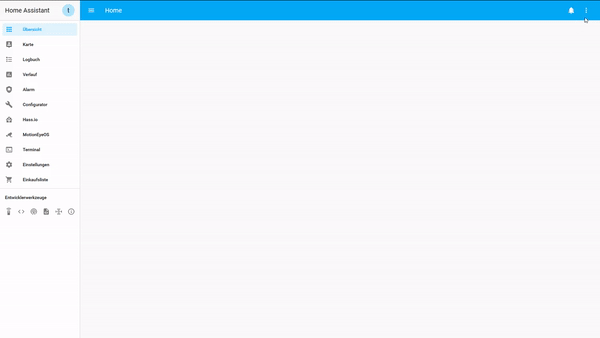

# 🎶MqTT RFID Music Player🎶

## About

With the MqTT RFID Music Player you can play music(Spotify) with an RFID tag.

## Installation

1. Download this Repository, import it in Platformio and click on upload(ALT+CMD+U)
```txt
https://github.com/marrobHD/Mqtt-RFID-Player/releases
```

2. Copy the "Files\HomeAssistant\automations.yaml" text into your automations.

3. Copy the "Files\HomeAssistant\scripts.yaml" text into your scripts.

4. Copy the "Files\HomeAssistant\input_number.yaml" text into your input_number.

5. Copy the "Files\HomeAssistant\input_select.yaml" text into your input_select.

6. paste this into your lovelace configuration file:

⮡ Lovelace yaml mode: paste it easy in your ui-lovelace.yaml

⮡ Lovelace UI edit mode:


```txt
- input_select.musikbox_rfid
- entity: automation.mqtt_rfid_music_player_tag1
  name: Tag 1
  tap_action: toggle
- entity: automation.mqtt_rfid_music_player_tag2
  name: Tag 2
  tap_action: toggle
- entity: automation.mqtt_rfid_music_player_zuruck
  name: Zurück
  tap_action: toggle
- entity: automation.mqtt_rfid_music_player_pause
  name: Pause
  tap_action: toggle
- entity: automation.mqtt_rfid_music_player_uberspringen
  name: Skip
  tap_action: toggle
- entity: automation.mqtt_rfid_music_player_button3_help
  name: Help Button
  tap_action: toggle
- entity: automation.mqtt_rfid_music_player_led_ausschaten
  name: Led turn off
  tap_action: toggle
- entity: automation.mqtt_rfid_music_player_button1_hold_2sec
  name: Button 1 2sec
  tap_action: toggle
- entity: automation.mqtt_rfid_music_player_button2_hold_2sec
  name: Button 2 2sec
  tap_action: toggle
- type: divider
  style:
    height: 1px
    width: 80%
    margin-left: auto
    margin-right: auto
    background: '#0000FF'
- entity: script.mqtt_rfid_player_tag1_play
  name: Tag 1 abspielen
- entity: script.mqtt_rfid_player_tag2_play
  name: Tag 2 abspielen
- entity: script.mqtt_rfid_player_back
  name: Back
- entity: script.mqtt_rfid_player_next_track
  name: Nächster Track
- entity: script.mqtt_rfid_player_pause
  name: Pause
- entity: script.mqtt_rfid_player_led_off
  name: Led off
- entity: script.mqtt_rfid_player_reset
  name: Reset resume
```

7. Restart homeassistant and have fun 🤖
